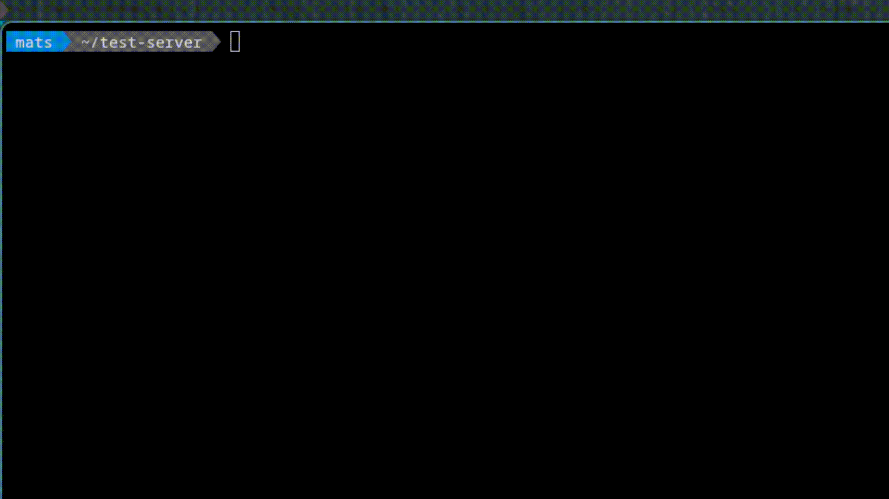

# mc - Minecraft Server Utility

A simple two-character command to quickly start Paper Minecraft servers for development and testing.
Just solves the minor inconvenience of getting out of your flow/terminal to test something quickly.



## What it does

- Downloads and starts Paper Minecraft servers
- Handles EULA acceptance automatically (by using this tool, you accept Minecraft's EULA)
- Manages multiple server versions in the same directory

## Installation

**Linux:**
```bash
curl -sfL https://github.com/Mindgamesnl/mc/releases/latest/download/mc-linux-amd64 -o mc && chmod +x mc && sudo mv mc /usr/local/bin/
```

**macOS:**
```
curl -sfL https://github.com/Mindgamesnl/mc/releases/latest/download/mc-darwin-amd64 -o mc && chmod +x mc && sudo mv mc /usr/local/bin/
```

**Windows PowerShell:**
```powershell
Invoke-WebRequest -Uri "https://github.com/Mindgamesnl/mc/releases/latest/download/mc-windows-amd64.exe" -OutFile "mc.exe"
```

**Manual:** Download from [releases](https://github.com/Mindgamesnl/mc/releases), make executable, and add to PATH.

## Usage

```bash
# Start a specific version (downloads if needed)
mc 1.21.4

# Run with existing setup (picks version interactively if multiple exist)  
mc

# Check if Java is working
mc test
```

## How it works

1. Creates `mc.yml` config file with defaults (2GB RAM, port 25565)
2. Downloads the Paper server jar for your version
3. Creates `eula.txt` (accepting Minecraft's EULA)
4. Starts the server

If you have multiple versions downloaded, `mc` shows a menu to pick which one to run.

## Configuration

Edit `mc.yml` to change settings:

```yaml
version: "1.21.4"
memory: "2G"      # RAM allocation
port: 25565       # Server port
```

## Building

```bash
git clone https://github.com/Mindgamesnl/mc.git
cd mc
go build -o mc
```
